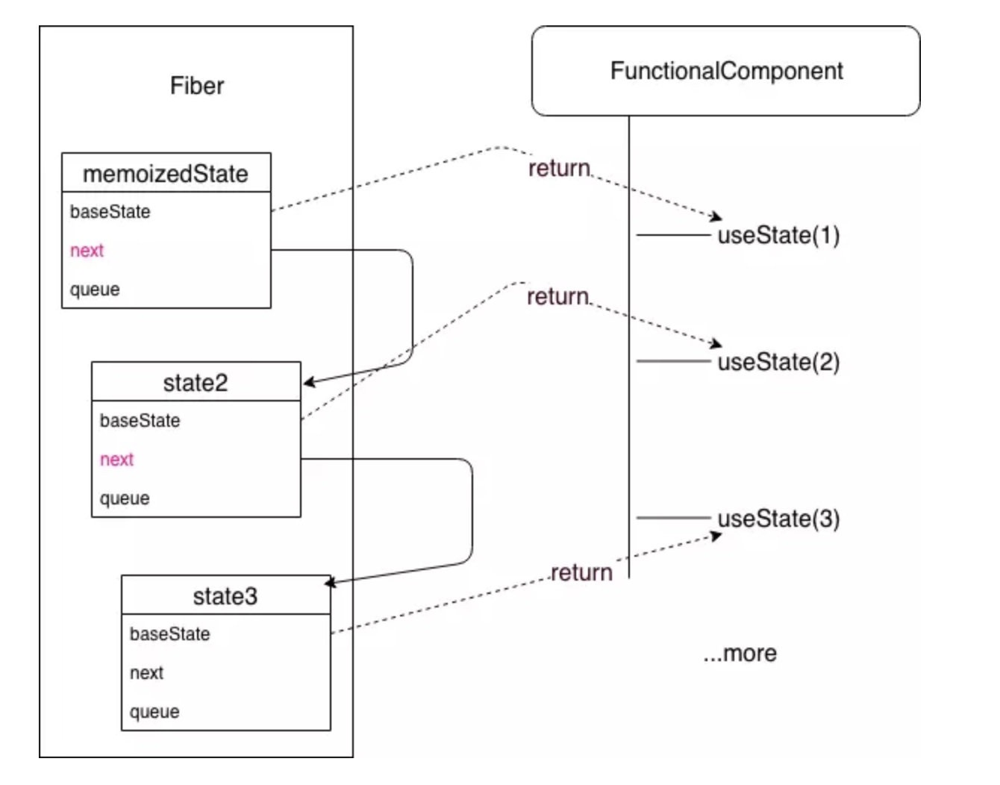

## setState

class 组件的特点，就是拥有特殊状态并且可以通过 setState 更新状态并重 新渲染视图，是 React 中最重要的 api。

问题：

1. setState 为什么是异步?

```js
// initial state = { counter: 0 }

function btnClick() {
  this.setState({ counter: this.state.counter + 1 }); // 异步
  console.log('counter + 1', this.state); // 执行顺序 1，{ counter: 0 }

  this.setState({ counter: this.state.counter + 2 }); // 异步
  console.log('counter + 2', this.state); // 执行顺序 2，{ counter: 0 }

  // 回调：同步
  this.setState({ counter: this.state.counter + 1 }, () => {
    console.log('counter + 1 回调', this.state); // 执行顺序 4，{ counter: 1 }
  });
  this.setState(nextState => {
    console.log('nextState', nextState); // 执行顺序 3，{ counter: 1 }， 取执行顺序 1 的结果
  });

  // 同步
  // setTimeout, setInterval
  setTimeout(() => {
    this.setState({ foo: 'bar' });
    console.log('setTimeout: ', this.state); // {counter: 1, foo: "bar"}
  }, 1000);
  // // 原⽣事件
  // button.addEventListener('click', () => {
  //   this.setState({ foo: 'bar' });
  // });
}
```

setState 并没有直接操作去渲染，⽽是执⾏了⼀个异步的 updater 队列 我们 使⽤⼀个类来专⻔管理，./my-react2/Component.js

1. setState()执⾏时，updater 会将 partialState 添加到它维护的 pendingStates 中，等到

2. updateComponent 负责合并 pendingStates 中所有 state 变成⼀个 state

3. forceUpdate 执⾏新旧 vdom ⽐对 diff 以及实际更新操作, 内部 call setState

```js
// 更新队列
export let updateQueue = {
  updaters: [],
  isPending: false,
  add(updater) {
    this.updaters.push(updater);
  },
  batchUpdate() {
    if (this.isPending) {
      return;
    }
    this.isPending = true;
    let { updaters } = this;
    let updater;
    while ((updater = updaters.pop())) {
      updater.updateComponent();
    }
    this.isPending = false;
  }
};

class Updater {
  constructor(instance) {
    this.instance = instance;
    this.pendingStates = []; // 待处理状态数组 、 state
    this.pendingCallbacks = []; //、callback数组
    this.isPending = false;
    this.nextProps = this.nextContext = null;
    this.clearCallbacks = this.clearCallbacks.bind(this);
  }

  emitUpdate(nextProps, nextContext) {
    this.nextProps = nextProps;
    this.nextContext = nextContext;
    // receive nextProps!! should update immediately
    nextProps || !updateQueue.isPending ? this.updateComponent() : updateQueue.add(this);
  }
  updateComponent() {
    let { instance, pendingStates, nextProps, nextContext } = this;
    if (nextProps || pendingStates.length > 0) {
      nextProps = nextProps || instance.props;
      nextContext = nextContext || instance.context;
      this.nextProps = this.nextContext = null;
      // getState 合并所有的state的数据，一次更新
      shouldUpdate(instance, nextProps, this.getState(), nextContext, this.clearCallbacks);
    }
  }
  addState(nextState) {
    if (nextState) {
      this.pendingStates.push(nextState);
      if (!this.isPending) {
        this.emitUpdate();
      }
    }
  }

  getState() {
    let { instance, pendingStates } = this;
    let { state, props } = instance;
    // console.log("pendingStates", pendingStates[0], pendingStates[1]);
    if (pendingStates.length) {
      //state = { ...state };
      pendingStates.forEach(nextState => {
        let isReplace = _.isArr(nextState);
        if (isReplace) {
          nextState = nextState[0];
        }
        if (_.isFn(nextState)) {
          nextState = nextState.call(instance, state, props);
        }
        // replace state
        if (isReplace) {
          state = { ...nextState };
        } else {
          state = { ...state, ...nextState };
        }
        console.log('Component.js getState: ', state);
      });
      pendingStates.length = 0;
    }
    return state;
  }
  clearCallbacks() {
    let { pendingCallbacks, instance } = this;
    if (pendingCallbacks.length > 0) {
      this.pendingCallbacks = [];
      pendingCallbacks.forEach(callback => callback.call(instance));
    }
  }
  addCallback(callback) {
    if (_.isFn(callback)) {
      this.pendingCallbacks.push(callback);
    }
  }
}
```

2. 为什么 setState 只有在 React 合成事件和⽣命周期数中是异步的，在原 ⽣事件和 setTimeout、setInterval、addEventListener 中都是同步的？

原⽣事件绑定不会通过合成事件的⽅式处理，⾃然也不会进⼊更新事务的处理流程。setTimeout 也⼀样，在 setTimeout 回调执⾏时已经完成了原更新组件流程，也不会再进⼊异步更新流程，其结果⾃然就是是同步的了。

## 虚拟 dom

react virtual dom 是什么？说⼀下 diff 算法？

what?
⽤ JavaScript 对象表示 DOM 信息和结构，当状态变更的时候，重新渲染这个 JavaScript 的对象结构。这个 JavaScript 对象称为 virtual dom；

why?
DOM 操作很慢，轻微的操作都可能导致⻚⾯重新排版，⾮常耗性能。相对于 DOM 对象，js 对象处理起来更快，⽽且更简单。通过 diff 算法对⽐新旧 vdom 之间的差异，可以批量的、最⼩化的执⾏ dom 操作，从⽽提⾼性能。

where?
react 中⽤ JSX 语法描述视图，通过 babel-loader 转译后它们变为 React.createElement(...)形式，该函数将⽣成 vdom 来描述真实 dom。将来 如果状态变化，vdom 将作出相应变化，再通过 diff 算法对⽐新⽼ vdom 区别从⽽做出最终 dom 操作。

how?
diff 算法: 算法复杂度 O(n)

### diff 策略

1. 同级⽐较，Web UI 中 DOM 节点跨层级的移动操作特别少，可以忽略不计。
2. 拥有不同类的两个组件将会⽣成不同的树形结构。 例如：div->p, CompA->CompB
3. 开发者可以通过 key prop 来暗示哪些⼦元素在不同的渲染下能保持稳定

### diff 过程

⽐对两个虚拟 dom 时会有三种操作：删除、替换和更新

- 删除：newVnode 不存在时
- 替换：vnode 和 newVnode 类型不同或 key 不同时
- 更新：有相同类型和 key 但 vnode 和 newVnode 不同时

参考 virtual-dom.js

```js
export function compareTwoVnodes(vnode, newVnode, node, parentContext) {
  let newNode = node;
  if (newVnode == null) {
    // remove
    destroyVnode(vnode, node);
    node.parentNode.removeChild(node);
  } else if (vnode.type !== newVnode.type || vnode.key !== newVnode.key) {
    // replace
    destroyVnode(vnode, node);
    newNode = initVnode(newVnode, parentContext);
    node.parentNode.replaceChild(newNode, node);
  } else if (vnode !== newVnode || parentContext) {
    // same type and same key -> update
    newNode = updateVnode(vnode, newVnode, node, parentContext);
  }
  return newNode;
}
```

1. 更新操作: 根据组件类型执⾏不同更新操作

```js
function updateVnode(vnode, newVnode, node, parentContext) {
  let { vtype } = vnode;

  //更新class类型组件
  if (vtype === VCOMPONENT) {
    return updateVcomponent(vnode, newVnode, node, parentContext);
  }

  //更新函数类型组件
  if (vtype === VSTATELESS) {
    return updateVstateless(vnode, newVnode, node, parentContext);
  }

  // ignore VCOMMENT and other vtypes
  if (vtype !== VELEMENT) {
    return node;
  }

  //更新原生
  let oldHtml = vnode.props[HTML_KEY] && vnode.props[HTML_KEY].__html;
  if (oldHtml != null) {
    // 设置了innerHTML时先更新当前元素，再初始化innerHTML
    updateVelem(vnode, newVnode, node, parentContext);
    initVchildren(newVnode, node, parentContext);
  } else {
    // 正常更新：先更新⼦元素，在更新当前元素
    updateVChildren(vnode, newVnode, node, parentContext);
    updateVelem(vnode, newVnode, node, parentContext);
  }
  return node;
}
```

patch 过程：虚拟 dom ⽐对最终要转换为对应 patch 操作，属性更新

```js
function updateVelem(velem, newVelem, node) {
  let isCustomComponent = velem.type.indexOf('-') >= 0 || velem.props.is != null;
  _.patchProps(node, velem.props, newVelem.props, isCustomComponent);
  if (velem.ref !== newVelem.ref) {
    detachRef(velem.refs, velem.ref, node);
    attachRef(newVelem.refs, newVelem.ref, node);
  }
  return node;
}
```

⼦元素更新:

```js
function updateVChildren(vnode, newVnode, node, parentContext) {
  // 更新children，产出三个patch数组
  let patches = {
    removes: [],
    updates: [],
    creates: []
  };
  diffVchildren(patches, vnode, newVnode, node, parentContext);
  _.flatEach(patches.removes, applyDestroy);
  _.flatEach(patches.updates, applyUpdate);
  _.flatEach(patches.creates, applyCreate);
}
```

## Hooks

- <https://reactjs.org/docs/hooks-intro.html>
- <https://www.youtube.com/watch?v=V-QO-KO90iQ&t=3060s>

1. Hooks 是什么？为了拥抱正能量函数式
2. Hooks 带来的变⾰，让函数组件有了状态，可以替代 class
3. 类似链表的实现原理

```js
import React, { useState, useEffect } from 'react'；

function FunComp(props) {
  const [data, setData] = useState('initialState');

  function handleChange(e) {
    setData(e.target.value);
  }

  useEffect(() => {
    subscribeToSomething();

    return () => {
      unSubscribeToSomething();
    };
  });

  return <input value={data} onChange={handleChange} />;
}

function FunctionalComponent() {
  const [state1, setState1] = useState(1);
  const [state2, setState2] = useState(2);
  const [state3, setState3] = useState(3);
}

// hook1 => Fiber.memoizedState
// state1 === hook1.memoizedState
// hook1.next => hook2
// state2 === hook2.memoizedState
// hook2.next => hook3
// state3 === hook2.memoizedState
```



## Fiber

1. 对于⼤型项⽬，组件树会很⼤，这个时候递归遍历的成本就会很⾼，会造成主线程被持续占⽤，结果就是主线程上的布局、动画等周期性任务就⽆法⽴即得到处理，造成视觉上的卡顿，影响⽤户体验。

2. 任务分解的意义 解决上⾯的问题

3. 增量渲染（把渲染任务拆分成块，匀到多帧）

4. 更新时能够暂停，终⽌，复⽤渲染任务

5. 给不同类型的更新赋予优先级

6. 并发⽅⾯新的基础能⼒

7. 更流畅
